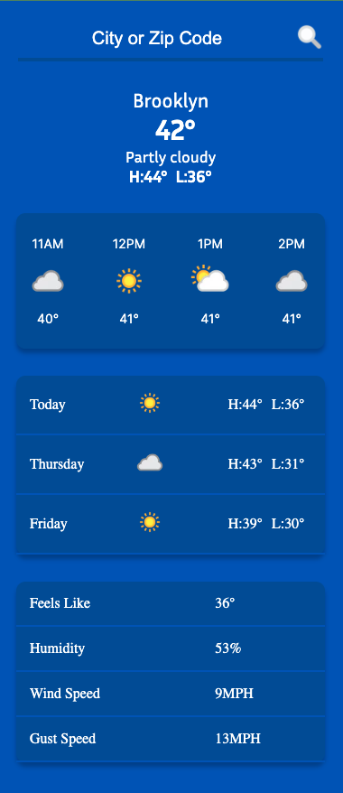
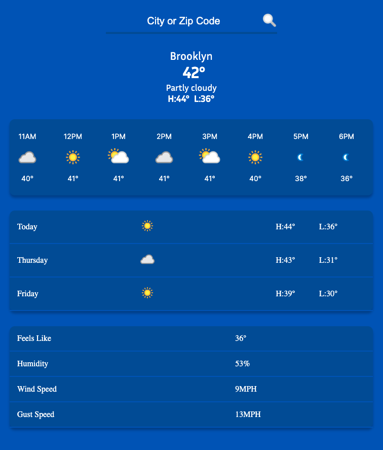
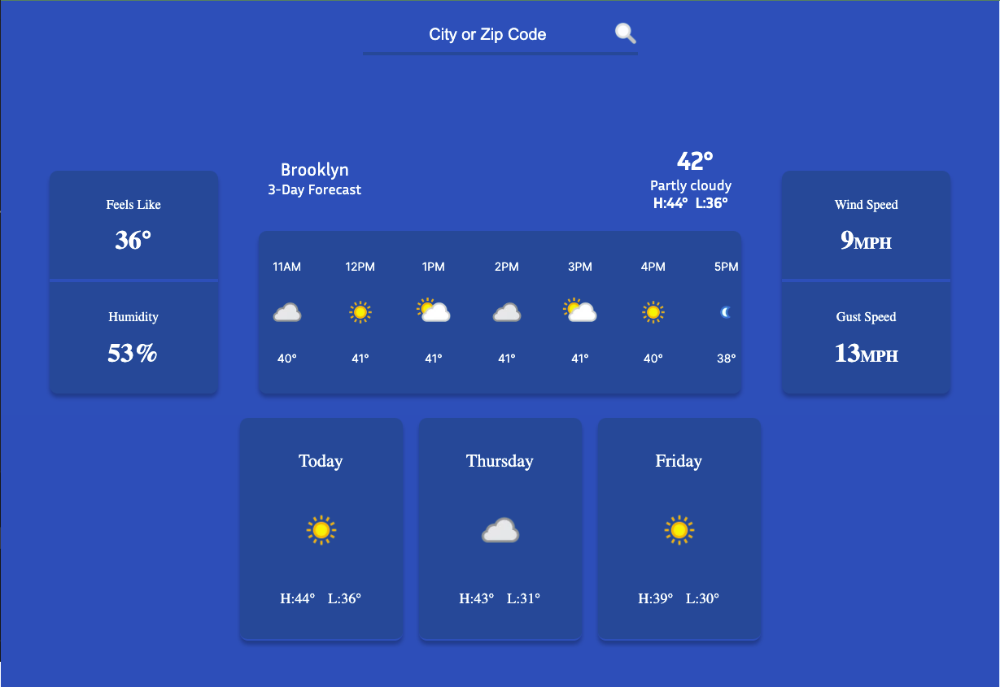

# Weather App

The primary goal of the application is to allow users to retrieve a 3-day weather forecast for any city or zipcode they query. It also provides additional details, including information on wind and gust speed, humidity, etc. Furthermore, the application offers a 24-hour forecast for the designated days. The development of this project utilized React and integrates with RapidAPI's Realtime Weather API (https://rapidapi.com/weatherapi/api/weatherapi-com).

<!--    -->

  

